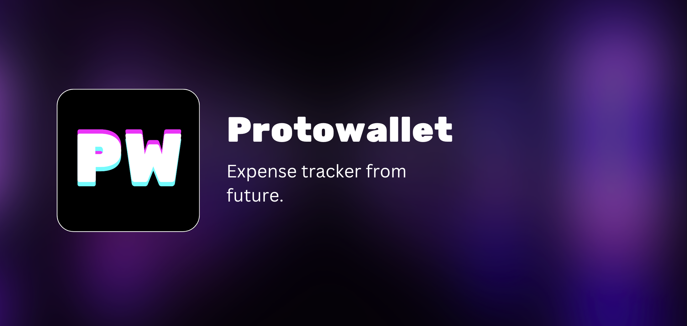

# Protowallet
✨ Protowallet - GPT powered, offline, hackable expense tracking application from future.

## Usage
|Where   	|Steps	|Data Storage   	|
|:----------:|:-------------:|:------:|
|Web 🌐 	|Visit web link (Coming soon) |Data stored in browser's memory (IndexedDB). 	|
|Your PC 💻   	|Download software (Coming soon)   	|Data stored on disk.   	|
|Docker 🐳  	|Pull docker image (Coming soon)   	|Data stored on mounted volume   	|
|Server 🫣|Start a server and access privately from anywhere.(Coming soon)|Data stored on server's disk.|
|Hack-away your own version 🫡|Install `@protowallet/core` from NPM and build your own application|Data storage can be configured seamlessly|

💡 **Protip:** Data can always be exported securely (encrypted by key) and imported anywhere / backed up by third party of your choice.
